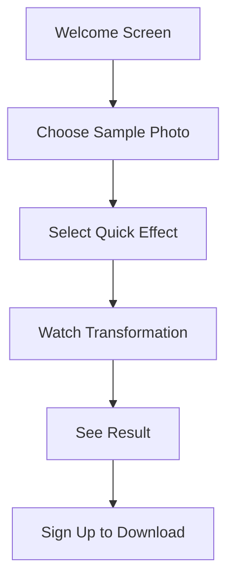

# Onboarding Design Specifications
*UX Designer Deliverable for Frontend Developer Implementation*

## Executive Summary
**Status**: Comprehensive onboarding flow designed to leverage performance optimizations and analytics infrastructure  
**Target**: >80% onboarding completion rate, <2 minutes time to first value  
**Foundation**: Built on existing tutorial framework and user progress system  

## User Journey Design Strategy

### Design Philosophy
1. **Progressive Disclosure**: Introduce features gradually to avoid cognitive overload
2. **Value-First Approach**: Show immediate benefit before requiring user investment
3. **Performance-Driven UX**: Leverage <1.2s load times for seamless experience
4. **Data-Informed Design**: Use analytics framework for continuous optimization

### Primary User Personas
- **Creative Newcomer**: First-time AI users seeking easy photo enhancement
- **Social Creator**: Active social media users looking for engaging content
- **Professional Explorer**: Photography/design professionals exploring AI tools

## Enhanced Onboarding Flow Design

### Phase 1: Welcome & Value Proposition (0-30 seconds)
**Objective**: Immediately demonstrate value and reduce bounce rate

#### Welcome Screen Enhancement
- **Hero Visual**: Interactive AI transformation preview (3-second loop)
- **Value Props**: "Transform photos in seconds", "No AI experience needed", "Professional results"
- **Social Proof**: "Join 50,000+ creators" with user-generated content carousel
- **CTA Hierarchy**: Primary "Try Free Effect", Secondary "Watch Demo"

#### Performance Optimizations Leveraged
- Preload hero visuals during initial bundle load
- Use optimized image components for social proof carousel
- Lazy load demo video until interaction

### Phase 2: Immediate Value Experience (30 seconds - 1 minute)
**Objective**: First effect completion without registration

#### Guest Experience Flow

#### Quick Win Experience Design
- **Sample Photo Selection**: 6 high-quality, diverse sample images
- **Instant Effect Preview**: 3 most popular effects with 5-second processing
- **Real-time Progress**: Animated progress with AI insights ("Analyzing composition...", "Applying artistic style...")
- **Result Celebration**: Animated reveal with confetti effect

#### Analytics Tracking Points
- Sample photo selected (track preferences)
- Effect chosen (track popular starting points)  
- Processing completion rate
- Registration conversion from result screen

### Phase 3: Registration & Personalization (1-2 minutes)
**Objective**: Convert guest users with personalized onboarding

#### Smart Registration Flow
- **Context-Aware Prompts**: "Save this result and create unlimited effects"
- **Social Login Priority**: Google/Apple sign-in for faster conversion
- **Progressive Profiling**: Collect usage intent after registration, not during

#### Personalization Questions (Post-Registration)
1. **Usage Intent**: "What brings you to Cosnap AI?"
   - Enhance social media photos
   - Explore artistic effects
   - Professional photography work
   - Fun photo experiments

2. **Experience Level**: "How familiar are you with AI photo tools?"
   - Complete beginner
   - Some experience
   - Advanced user

3. **Content Type Focus**: "What do you photograph most?"
   - Portraits & selfies
   - Landscapes & travel
   - Products & objects
   - Mixed content

### Phase 4: Feature Discovery & Mastery (2-5 minutes)
**Objective**: Deep engagement with core features

#### Guided Tutorial Sequence
Using existing `TutorialOverlay` component with enhanced UX:

1. **Effect Library Tour**
   - Spotlight on categories with visual previews
   - Interactive filter demonstration
   - "Try any effect" encouragement

2. **Upload & Customization**
   - File upload best practices tooltip
   - Parameter adjustment introduction
   - Real-time preview system

3. **Results & Sharing**
   - Download options explanation
   - Social sharing integration
   - Community features introduction

#### Milestone-Driven Progression
Leverage existing `useUserProgress` hook:
- **First Upload**: +30 points, unlock advanced effects
- **Parameter Customization**: +25 points, tutorial completion badge
- **First Share**: +40 points, community member status

## Mobile-First Design Optimizations

### Mobile Onboarding Adaptations
- **Vertical Video Format**: Sample transformations in 9:16 aspect ratio
- **Thumb-Friendly Controls**: Large tap targets, swipe gestures
- **Progressive Loading**: Skeleton screens during effect processing
- **Gesture Education**: Subtle animations showing swipe/tap interactions

### Responsive Design Breakpoints
- **Mobile**: 320px-768px - Stack layout, full-width cards
- **Tablet**: 768px-1024px - 2-column grid, condensed navigation  
- **Desktop**: 1024px+ - 3-column layout, sidebar tutorials

## Performance-Optimized UX Patterns

### Loading State Design
Leveraging frontend performance improvements:

#### Progressive Image Loading
- **Placeholder Strategy**: Low-quality base64 images while loading
- **WebP Optimization**: Automatic format detection and conversion
- **Intersection Observer**: Load images as they enter viewport

#### Processing States
- **Micro-Animations**: Subtle progress indicators (<50ms response time)
- **Predictive Loading**: Pre-fetch likely next effects during processing
- **Background Processing**: Continue onboarding while effect processes

### Memory-Efficient UX
- **Image Cleanup**: Automatic cleanup of processed images not downloaded
- **Component Unmounting**: Aggressive cleanup of off-screen components
- **State Management**: Minimal redux/context state for onboarding flow

## Conversion Optimization Strategy

### Funnel Analysis Integration
Using analytics infrastructure for A/B testing:

#### Test Variations
1. **Hero Message Testing**
   - A: "Create stunning AI art in seconds"
   - B: "Transform photos like a pro"
   - C: "AI photo magic for everyone"

2. **Sample Photo Strategy**
   - A: User upload required
   - B: Choose from samples first
   - C: Hybrid approach

3. **Registration Timing**
   - A: Immediate registration required
   - B: Guest experience first
   - C: Progressive registration

#### Success Metrics
- **Primary**: Registration completion rate >60%
- **Secondary**: First effect completion >80%
- **Tertiary**: 7-day retention >40%

### Drop-off Optimization
Based on 9-step conversion funnel tracking:

#### Critical Drop-off Points
1. **Welcome → Sample Selection**: Reduce cognitive load
2. **Processing → Result**: Ensure processing reliability
3. **Result → Registration**: Optimize value proposition
4. **Registration → Upload**: Streamline file handling

#### Recovery Mechanisms
- **Exit Intent**: Offer quick tutorial video
- **Abandonment**: Email with sample results
- **Processing Failure**: Suggest alternative effects

## Social Proof & Community Integration

### Social Elements in Onboarding
- **User Gallery**: Recent transformations from new users
- **Success Stories**: "User X got 1K likes with this effect"
- **Community Highlights**: Featured community creations

### Social Sharing Optimization
- **One-Click Sharing**: Pre-populated social posts
- **Platform Optimization**: Format results for Instagram/TikTok/WeChat
- **Viral Mechanics**: "Created with Cosnap AI" branding

## Accessibility & Inclusive Design

### Universal Design Principles
- **Keyboard Navigation**: Full keyboard support for all interactions
- **Screen Reader Support**: Comprehensive ARIA labels and descriptions
- **Color Accessibility**: High contrast mode, colorblind-friendly palette
- **Font Accessibility**: Adjustable text sizes, dyslexia-friendly fonts

### Internationalization Considerations
- **RTL Support**: Layout adaptation for Arabic/Hebrew users
- **Cultural Sensitivity**: Appropriate imagery for different markets
- **Local Social Platforms**: Integration with WeChat, LINE, etc.

## Implementation Priority Matrix

### Phase 1 - Critical Path (Week 3)
**Frontend Developer Implementation Priority**

1. **Enhanced Welcome Screen** (HIGH)
   - Interactive hero section
   - Performance-optimized image carousel
   - Value proposition testing variants

2. **Guest Experience Flow** (HIGH)
   - Sample photo selection interface
   - Streamlined effect application
   - Registration conversion optimization

3. **Mobile Optimizations** (MEDIUM)
   - Responsive design breakpoints
   - Touch-friendly interactions
   - Progressive loading states

### Phase 2 - Enhancement (Week 4)
1. **Advanced Tutorial Integration** (MEDIUM)
   - Enhanced tutorial overlay visuals
   - Interactive feature discovery
   - Milestone celebration animations

2. **Analytics Integration** (HIGH)
   - A/B testing framework
   - Conversion funnel tracking
   - Performance optimization metrics

### Phase 3 - Optimization (Week 5+)
1. **Social Features** (LOW)
   - Community integration
   - Social sharing optimization
   - User-generated content display

2. **Accessibility Enhancements** (MEDIUM)
   - Screen reader optimization
   - Keyboard navigation
   - Internationalization support

## Cross-Agent Integration Points

### Frontend Developer Requirements
- **Component Updates**: Enhanced `OnboardingFlow` with new phases
- **Analytics Integration**: Track all funnel steps with existing analytics
- **Performance Monitoring**: Use `PerformanceMonitor` for onboarding metrics
- **Mobile Components**: Responsive design implementation

### Backend Architect Requirements  
- **Guest User Support**: Temporary sessions for guest experience
- **Onboarding Analytics**: Additional database schema for onboarding events
- **Performance Optimization**: API endpoints optimized for onboarding flow
- **A/B Testing Support**: Variant serving and analytics collection

### Business Analyst Requirements
- **Conversion Tracking**: Detailed funnel analysis and reporting
- **User Segmentation**: Onboarding performance by user type
- **ROI Measurement**: Customer acquisition cost optimization
- **Feature Adoption**: Post-onboarding engagement tracking

## Success Metrics & KPIs

### Primary Objectives
- **Onboarding Completion Rate**: >80% (current baseline needed)
- **Time to First Value**: <2 minutes from landing
- **Registration Conversion**: >60% from guest experience
- **7-Day Retention**: >40% of onboarded users

### Secondary Metrics
- **Effect Discovery Rate**: Users trying >3 effects in first session
- **Social Sharing Rate**: >25% share their first creation
- **Parameter Usage**: >50% customize effect parameters
- **Community Engagement**: >30% join community features

### Performance Metrics
- **Loading Performance**: Maintain <1.2s FCP during onboarding
- **Error Rate**: <1% failures during onboarding flow
- **Mobile Performance**: <2s time to interactive on mobile
- **Accessibility Score**: >95% WCAG 2.1 AA compliance

## Implementation Notes

### Technical Requirements
- **Progressive Enhancement**: Core functionality works without JavaScript
- **Offline Support**: Basic onboarding available offline
- **Cross-Browser**: Support for Safari, Chrome, Firefox, Edge
- **Security**: Secure handling of guest sessions and user data

### Design System Integration
- **Component Consistency**: Use existing design tokens and components
- **Brand Alignment**: Maintain brand voice throughout onboarding
- **Documentation**: Update design system with new patterns
- **Testing**: Comprehensive unit and integration testing

This comprehensive onboarding design specification leverages all the performance optimizations and analytics infrastructure built by other agents, providing a detailed blueprint for implementation that will significantly improve user conversion and engagement.