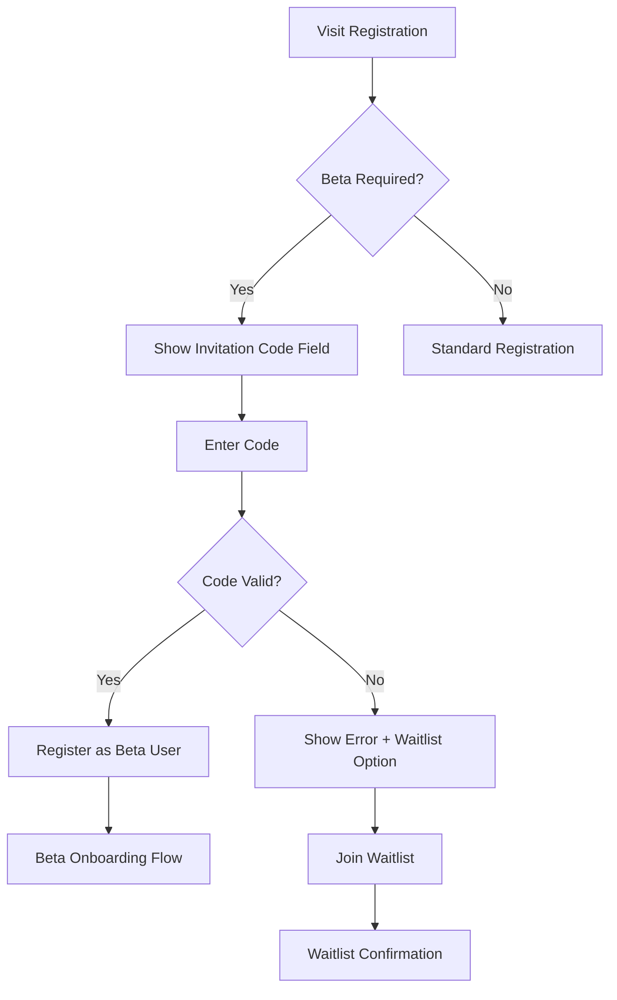
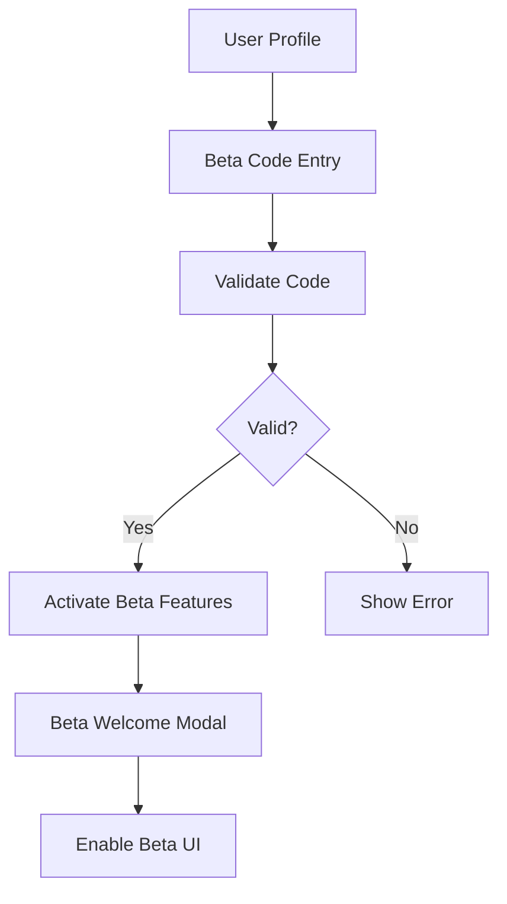
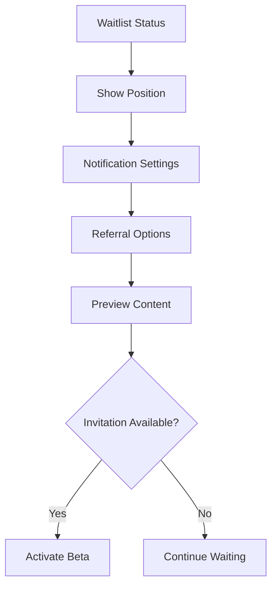

# Beta User System - Frontend Integration Requirements
## Week 3 Sprint - Day 1 Planning

**Date:** August 22, 2025  
**Stakeholder:** Frontend Developer  
**Scope:** Frontend components and flows for beta user invitation system

---

## Overview

The beta user system will provide controlled access to Cosnap AI during the initial launch phase. This document outlines frontend requirements for seamless integration with the backend beta user management system.

---

## Core Beta User Features Required

### 1. **Beta Invitation Code System**

#### Registration Flow Enhancement
```tsx
// Enhanced Register component requirements
interface BetaRegistrationProps {
  requireInvitationCode: boolean;
  allowWaitlist: boolean;
  maxBetaUsers?: number;
}
```

**Frontend Components Needed:**
- `BetaInvitationInput.tsx` - Invitation code entry field
- `BetaWaitlistSignup.tsx` - Waitlist registration when codes exhausted
- `BetaStatusIndicator.tsx` - Shows beta status to users

#### User Experience Flow:
1. **Registration Page** → Check if invitation code required
2. **Invitation Code Entry** → Validate code real-time
3. **Success/Waitlist** → Based on code availability
4. **Beta User Dashboard** → Special features for beta users

### 2. **Beta User Dashboard Components**

#### Enhanced User Interface
```tsx
interface BetaUserFeatures {
  exclusiveEffects: string[];        // Beta-only AI effects
  priorityProcessing: boolean;       // Faster queue processing
  advancedFeatures: boolean;         // Advanced parameter controls
  feedbackSystem: boolean;           // In-app feedback collection
  usageAnalytics: boolean;          // Personal usage statistics
}
```

**New Components Required:**
- `BetaUserBadge.tsx` - Visual beta user identifier
- `BetaFeatureFlag.tsx` - Conditional feature rendering
- `BetaFeedbackModal.tsx` - Integrated feedback collection
- `BetaUsageStats.tsx` - Personal analytics dashboard

### 3. **Waitlist Management System**

#### Waitlist Components
```tsx
interface WaitlistFeatures {
  positionTracking: boolean;         // Show queue position
  notificationSettings: boolean;     // Email/SMS preferences
  socialSharing: boolean;           // Referral system
  earlyAccessPerks: boolean;        // Preview content access
}
```

**Components Needed:**
- `WaitlistPosition.tsx` - Shows current queue position
- `WaitlistNotifications.tsx` - Notification preferences
- `ReferralSystem.tsx` - Social sharing for queue advancement
- `PreviewAccess.tsx` - Limited feature preview for waitlist users

---

## Technical Implementation Requirements

### 1. **Authentication System Integration**

#### Enhanced AuthContext
```tsx
interface BetaAuthUser extends AuthUser {
  betaStatus: 'active' | 'waitlist' | 'none';
  betaFeatures: string[];
  invitationCode?: string;
  waitlistPosition?: number;
  betaStartDate?: string;
  usageQuota?: {
    daily: number;
    used: number;
    remaining: number;
  };
}
```

#### Required Auth Methods
```tsx
interface BetaAuthMethods {
  validateInvitationCode: (code: string) => Promise<boolean>;
  joinWaitlist: (email: string, preferences: any) => Promise<number>;
  checkBetaStatus: (userId: string) => Promise<BetaAuthUser>;
  activateBetaAccess: (invitationCode: string) => Promise<boolean>;
}
```

### 2. **Feature Flag System**

#### Component-Level Feature Gating
```tsx
// Usage example
<BetaFeatureFlag feature="advanced-effects" fallback={<StandardEffects />}>
  <AdvancedEffectsPanel />
</BetaFeatureFlag>

<BetaFeatureFlag feature="priority-processing">
  <PriorityQueueIndicator />
</BetaFeatureFlag>
```

#### Hook for Feature Detection
```tsx
const useBetaFeatures = () => {
  const { user } = useAuth();
  
  return {
    hasFeature: (feature: string) => user?.betaFeatures?.includes(feature),
    isBetaUser: user?.betaStatus === 'active',
    isWaitlisted: user?.betaStatus === 'waitlist',
    waitlistPosition: user?.waitlistPosition
  };
};
```

### 3. **API Integration Points**

#### New API Endpoints Required
```typescript
// Beta user management endpoints
POST /api/beta/validate-code      // Validate invitation code
POST /api/beta/join-waitlist      // Join waitlist
GET  /api/beta/status/:userId     // Get beta status
POST /api/beta/activate           // Activate beta access
GET  /api/beta/features           // Get available beta features
POST /api/beta/feedback           // Submit beta feedback
GET  /api/beta/analytics/:userId  // Get usage analytics
```

#### Service Layer Integration
```tsx
// betaUserService.ts
export const betaUserService = {
  validateInvitationCode: async (code: string) => {
    // Implementation with error handling
  },
  
  joinWaitlist: async (userData: any) => {
    // Implementation with queue position return
  },
  
  getBetaStatus: async (userId: string) => {
    // Implementation with comprehensive status
  }
};
```

---

## UI/UX Requirements

### 1. **Visual Design System**

#### Beta User Branding
- **Beta Badge Colors:** Gold/Premium styling (#FFD700)
- **Exclusive Feature Highlight:** Purple accent (#8B5CF6)
- **Waitlist UI:** Blue/Trust colors (#3B82F6)
- **Priority Indicators:** Green success colors (#10B981)

#### Component Styling Standards
```css
/* Beta user badge styling */
.beta-badge {
  background: linear-gradient(135deg, #FFD700 0%, #FFA500 100%);
  color: #1F2937;
  font-weight: 600;
  text-transform: uppercase;
  letter-spacing: 0.5px;
}

/* Beta feature highlight */
.beta-feature {
  border: 2px solid #8B5CF6;
  background: rgba(139, 92, 246, 0.1);
  position: relative;
}

.beta-feature::before {
  content: "BETA";
  position: absolute;
  top: -8px;
  right: 8px;
  background: #8B5CF6;
  color: white;
  padding: 2px 8px;
  font-size: 10px;
  border-radius: 4px;
}
```

### 2. **Mobile-First Beta Experience**

#### Responsive Beta Components
- Touch-optimized beta feature discovery
- Mobile-friendly waitlist signup
- Thumb-friendly beta dashboard navigation
- Progressive enhancement for beta features

#### Performance Considerations
- Lazy load beta-specific components
- Conditional bundle loading for beta features
- Optimized beta asset delivery
- Beta feature usage analytics

---

## User Flow Documentation

### 1. **New User Registration with Beta Code**



### 2. **Existing User Beta Activation**



### 3. **Waitlist User Experience**



---

## Component Architecture

### 1. **Beta Context Provider**

```tsx
// BetaContext.tsx
interface BetaContextValue {
  betaStatus: BetaStatus;
  betaFeatures: string[];
  waitlistPosition?: number;
  usageQuota?: UsageQuota;
  
  // Actions
  validateCode: (code: string) => Promise<boolean>;
  joinWaitlist: (data: WaitlistData) => Promise<number>;
  activateBeta: (code: string) => Promise<boolean>;
  submitFeedback: (feedback: BetaFeedback) => Promise<void>;
  
  // Utilities
  hasFeature: (feature: string) => boolean;
  canUseFeature: (feature: string) => boolean;
  getRemainingQuota: () => number;
}

export const BetaProvider: React.FC<{children: React.ReactNode}> = ({children}) => {
  // Implementation
};
```

### 2. **Beta Feature Components**

```tsx
// BetaFeatureFlag.tsx
interface BetaFeatureFlagProps {
  feature: string;
  fallback?: React.ReactNode;
  children: React.ReactNode;
  requireAuth?: boolean;
}

// BetaUserBadge.tsx
interface BetaUserBadgeProps {
  size?: 'sm' | 'md' | 'lg';
  variant?: 'badge' | 'label' | 'icon';
  showDetails?: boolean;
}

// BetaWaitlistSignup.tsx
interface BetaWaitlistSignupProps {
  onSuccess: (position: number) => void;
  onError: (error: string) => void;
  collectPreferences?: boolean;
  showReferralOptions?: boolean;
}
```

---

## Implementation Timeline

### Phase 1: Core Beta Infrastructure (Day 2-3)
- [ ] Enhance AuthContext with beta user support
- [ ] Create BetaContext provider
- [ ] Implement beta feature flag system
- [ ] Add beta user API service layer

### Phase 2: Beta UI Components (Day 3-4)
- [ ] BetaUserBadge component
- [ ] BetaFeatureFlag component
- [ ] BetaInvitationInput component
- [ ] BetaWaitlistSignup component

### Phase 3: Enhanced User Flows (Day 4-5)
- [ ] Update registration flow with beta code support
- [ ] Create beta user dashboard
- [ ] Implement waitlist management interface
- [ ] Add beta feedback collection system

### Phase 4: Testing & Optimization (Day 5-6)
- [ ] Beta user flow testing
- [ ] Mobile beta experience validation
- [ ] Performance optimization for beta features
- [ ] Analytics integration for beta usage

---

## Analytics & Monitoring Requirements

### 1. **Beta User Metrics**
- Beta code usage rates
- Feature adoption by beta users
- Beta user retention rates
- Feedback sentiment analysis
- Beta feature performance impact

### 2. **Waitlist Metrics**
- Waitlist conversion rates
- Average wait time
- Referral effectiveness
- Waitlist abandonment rates
- Preview content engagement

### 3. **A/B Testing Framework**
- Beta feature flag experiments
- Beta onboarding flow variations
- Waitlist signup optimization
- Beta user engagement tests

---

## Security Considerations

### 1. **Invitation Code Security**
- Server-side code validation only
- Code expiration handling
- Rate limiting for code attempts
- Audit trail for code usage

### 2. **Beta Feature Access Control**
- Server-side feature flag validation
- Client-side UI enhancement only
- Proper API endpoint protection
- Beta user session management

### 3. **Data Privacy**
- Beta user data classification
- GDPR compliance for waitlist data
- Beta feedback data handling
- Analytics data anonymization

---

## Success Metrics

### 1. **Beta Launch KPIs**
- **Target:** 1000 beta users in first week
- **Conversion:** >60% from waitlist to active beta
- **Engagement:** >80% beta feature adoption
- **Feedback:** >4.5/5 average beta experience rating

### 2. **Technical Performance**
- **Load Time:** <2s for beta feature rendering
- **Error Rate:** <1% for beta-specific functionality
- **Mobile UX:** >90% mobile beta user satisfaction
- **API Response:** <200ms for beta status checks

---

## Next Steps

### Immediate Actions (Next 4 hours)
1. **Review backend beta API specifications**
2. **Create BetaContext provider architecture**
3. **Design beta user badge component**
4. **Plan beta invitation code UI/UX**

### Day 2 Priorities
1. **Implement core beta infrastructure**
2. **Create beta feature flag system**
3. **Build beta invitation code validation**
4. **Design beta user dashboard mockups**

### Integration Points with Other Teams
- **Backend Architect:** API endpoint specifications
- **UI/UX Designer:** Beta user interface design
- **Business Analyst:** Beta metrics and analytics setup
- **Content Marketer:** Beta user communication templates

---

## Conclusion

The beta user system frontend requirements are well-defined and achievable within the Week 3 Sprint timeline. The modular component architecture ensures scalability and maintainability while providing a premium experience for early adopters.

**Risk Level:** LOW - Clear implementation path with existing infrastructure support.  
**Complexity:** MEDIUM - Requires careful state management and user flow coordination.  
**Priority:** HIGH - Critical for controlled launch strategy.